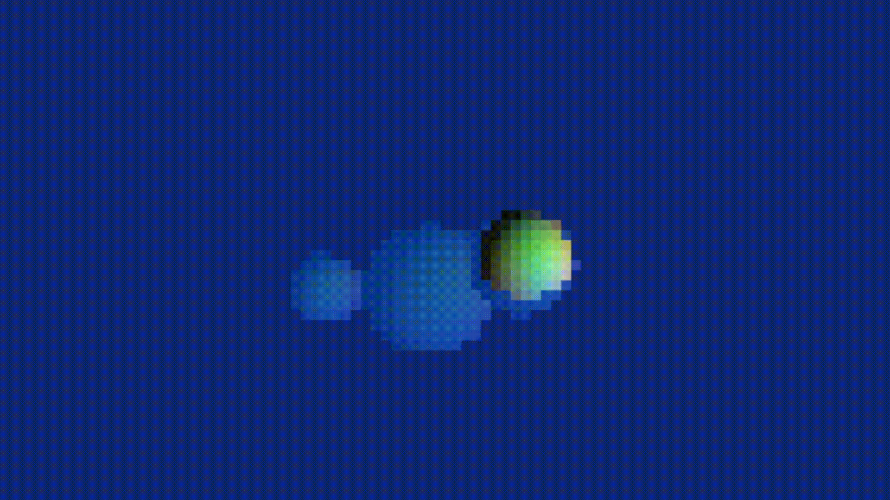

# 🌊 RealTimeRaytracer

A real-time CPU-based raytracing engine written in C++ featuring realistic lighting effects, including **refraction through water**.

While running entirely on the CPU, this project demonstrates ray-object intersection, light calculations, and material simulation at interactive frame rates.

<div align="center">
  
</div>

---

## ✨ Features

- 🔦 Real-time raytracing pipeline
- 🌊 Transparent materials with water refraction
- 💡 Physically-inspired lighting calculations
- 🖥️ CPU-only rendering (no GPU raytracing acceleration)

---

## 🛠️ Technologies

- **Language:** C++
- **Graphics API:** OpenGL
- **Rendering:** Custom CPU raytracing engine

---

## 🚀 Getting Started

### Prerequisites

Before running the project, make sure your development environment has:

- C++ compiler
- OpenGL configured
- Required OpenGL dependencies installed

### Running

1. Clone the repository:

```bash
git clone https://github.com/ARid01/RealTimeRaytracer.git
```

2. Open the project in your IDE.

3. Ensure OpenGL is properly configured.

4. Build and run.

---

## 🧠 Implementation Details

The renderer works by tracing rays from the camera through each pixel and calculating:

- Ray-object intersections
- Surface normals
- Lighting contributions
- Refraction behavior

The current implementation uses CPU rendering, resulting in a lower resolution but allowing the raytracing algorithms to be implemented from scratch.

---

## 📌 Purpose

This project was created to explore:
- Computer graphics fundamentals
- Raytracing algorithms
- Rendering optimization
- Low-level graphics programming
